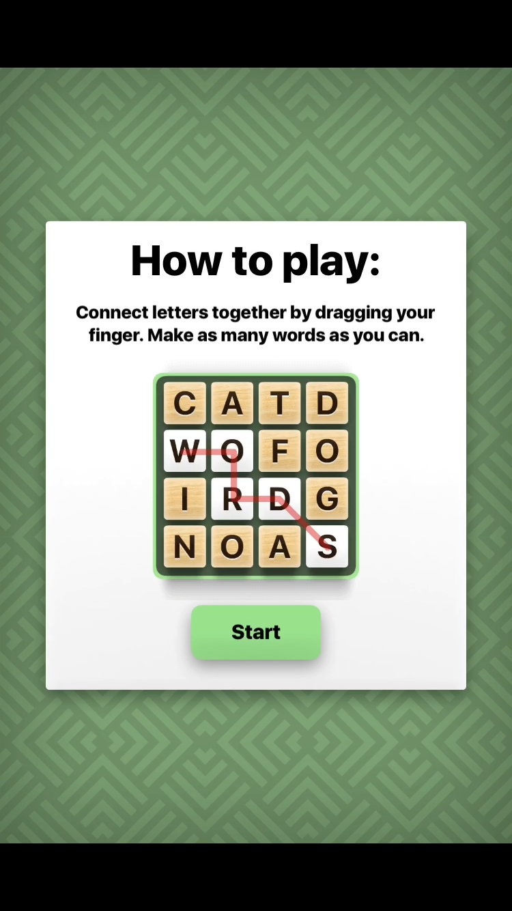
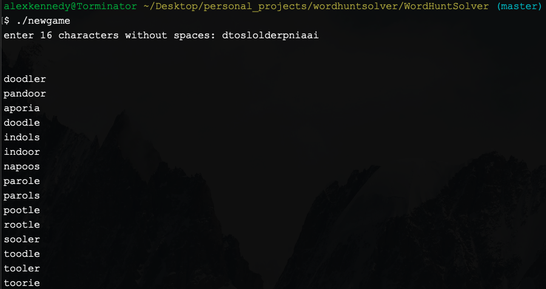

Description:
If you're unfamiliar with WordHunt, check out the demo section first. The program takes in 16 characters from the 4x4 WordHunt board. The characters on the board should be entered from top to bottom and left to right as they appear on the board. Enter contiguously in lowercase without spaces. Then it loops through currdict.txt, which contains ~192k words of length 9 through 6 and prints out matching words to the standard output.

<h3>Demo:</h3>
The instructions for the game are as follows:

<body> Here is a live demo </body>

note:
wordhunt.cpp and wordhunt.py do the same thing. I originally wrote the program in Python but I wanted fast performance so I wrote the final version in C++ (and included some minor improvements to time/memory complexity and organization).
